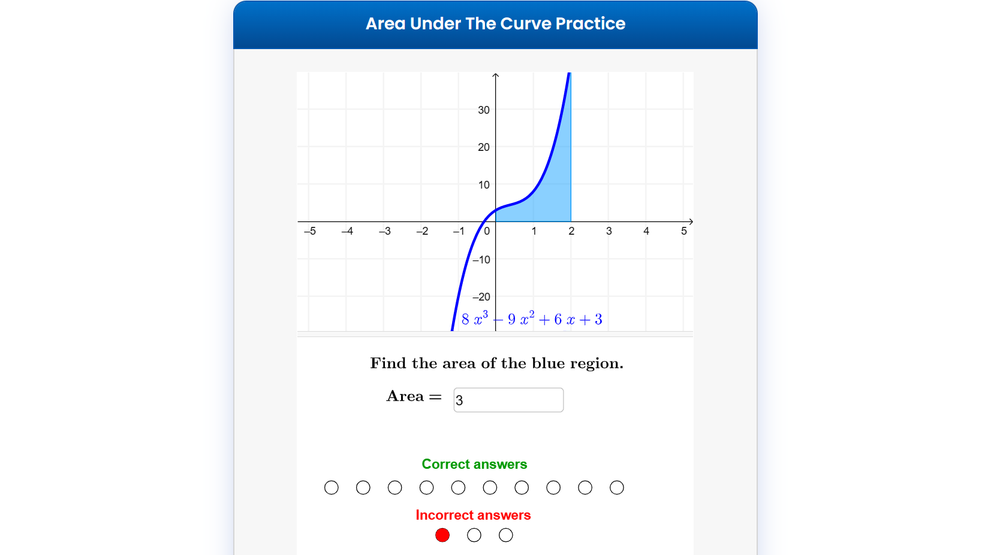

# Area under the curve practice problems

This is an interactive mathematics app built with GeoGebra. It generates practice problems for the topic of Area under the curve using integrals.

## Table of contents

- [Overview](#overview)
  - [Instructions](#instructions)
  - [Screenshot](#screenshot)
  - [Links](#links)
- [My process](#my-process)
  - [Built with](#built-with)
- [Author](#author)


## Overview

## Instructions
1. This app requires [GeoGebra](https://www.geogebra.org/) to inject the app.

2. The app itself was built using the GeoGebra Classic tool, and GeoGebra Script.

3. The app was then injected on the document using JavaScript:  

```js
const injectApp = () => {
    const params = {"material_id":"qm5hudcg", "borderColor":"#FFFFFF",};
    const ggbApplet = new GGBApplet(params, true);
    ggbApplet.setHTML5Codebase("https://www.geogebra.org/apps/5.0.498.0/web3d");
    ggbApplet.inject('ggb-element');
}
```

### Screenshot



### Links

- Live Site URL: [https://jefferh30.github.io/Area-under-the-curve-practice-problems/](https://jefferh30.github.io/Area-under-the-curve-practice-problems/)

## My process

### Built with

- Semantic HTML5 markup
- Simple CSS
- Simple JavaScript
- GeoGebra
- GeoGebra Script

## Author

- Website - [Jefferson Huera](https://www.neurochispas.com)
